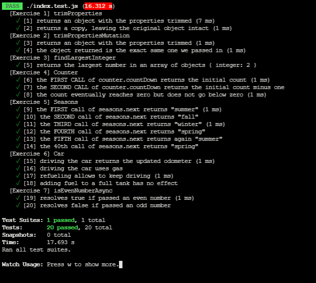

# Unit Testing

## Introduction

## Instructions

### Task 1: Project Setup

There are two possible ways to submit your project. Your instructor should have communicated which method to use for this project during the Guided Project and in your cohort's Slack channel. If you are still unsure, reach out to Lambda Staff.

#### Option A - Codegrade

- [ ] Fork and clone the repository.
- [ ] Open the assignment in Canvas and click on the "Set up git" option.
- [ ] Follow instructions to set up Codegrade's Webhook and Deploy Key.
- [ ] Push your first commit: `git commit --allow-empty -m "first commit" && git push`.
- [ ] Check to see that Codegrade has accepted your git submission.

#### Option B - Pull Request

- [ ] Fork and clone the repository.
- [ ] Implement your project in a `firstname-lastname` branch.
- [ ] Create a pull request of `firstname-lastname` against your `main` branch.
- [ ] Open the assignment in Canvas and submit your pull request.

### Task 2: Minimum Viable Product

- [ ] For Exercises 1-7 inside `index.js`:
  - [ ] Write the tests in `index.test.js`.
  - [ ] Implement the function or the class in `index.js`.

#### Notes

- Run `index.js` with Nodemon executing `npm run dev`.
- Run tests locally with Jest executing `npm test`.
- You can add console.logs to `index.js` to manually test your code. (e.g. `console.log(car.drive(10));`).
- The output of your log statements can be found in the terminal you run `npm run dev` in.

#### Hot Tips

- You will need to brush up on your JavaScript and use the Jest documentation to solve this challenge.
- Do not alter your `package.json` file except to install extra libraries or add extra scripts.
- In your solution, it is essential that you follow best practices and produce clean and professional results.
- Schedule time to review, refine, and assess your work.
- Perform basic professional polishing including spell-checking and grammar-checking on your work.

# Result:

```

 PASS  ./index.test.js (16.312 s)
  [Exercise 1] trimProperties
    ✓ [1] returns an object with the properties trimmed (7 ms)
    ✓ [2] returns a copy, leaving the original object intact (1 ms)
  [Exercise 2] trimPropertiesMutation
    ✓ [3] returns an object with the properties trimmed (1 ms)
    ✓ [4] the object returned is the exact same one we passed in (1 ms)
  [Exercise 3] findLargestInteger
    ✓ [5] returns the largest number in an array of objects { integer: 2 }
  [Exercise 4] Counter
    ✓ [6] the FIRST CALL of counter.countDown returns the initial count (1 ms)
    ✓ [7] the SECOND CALL of counter.countDown returns the initial count minus one
    ✓ [8] the count eventually reaches zero but does not go below zero (1 ms)
  [Exercise 5] Seasons
    ✓ [9] the FIRST call of seasons.next returns "summer" (1 ms)
    ✓ [10] the SECOND call of seasons.next returns "fall"
    ✓ [11] the THIRD call of seasons.next returns "winter" (1 ms)
    ✓ [12] the FOURTH call of seasons.next returns "spring"
    ✓ [13] the FIFTH call of seasons.next returns again "summer"
    ✓ [14] the 40th call of seasons.next returns "spring"
  [Exercise 6] Car
    ✓ [15] driving the car returns the updated odometer (1 ms)
    ✓ [16] driving the car uses gas
    ✓ [17] refueling allows to keep driving (1 ms)
    ✓ [18] adding fuel to a full tank has no effect
  [Exercise 7] isEvenNumberAsync
    ✓ [19] resolves true if passed an even number (1 ms)
    ✓ [20] resolves false if passed an odd number

Test Suites: 1 passed, 1 total
Tests:       20 passed, 20 total
Snapshots:   0 total
Time:        17.693 s
Ran all test suites.


```


